# ルーターとL2スイッチによるVLAN間ルーティング (Router-on-a-Stick)

- 通常異なるVLANに属するPC同士は通信できない
- 異なるVLANに属するPC同士の通信を可能にする技術をVLAN間ルーティングという
- VLAN間ルーティングの実装には次の2通りがある
  - L2スイッチと外部ルーターを用いる方法
  - L3スイッチ単体を使う方法
- 今回は、ルーターとL2スイッチを用いてVLAN間のルーティング設定を行う
- この方法では、ルーターの単一の物理インターフェースに複数の論理的なサブインターフェースを設定することでVLAN間ルーティングを可能にする

## フォルダ構成
```
VLAN/
├─ topology.png
├─ switch-config.txt
├─ router-config.txt
├─ vlan-lab.pkt
├─ ping-results/
│   ├─ pc0_to_pc1.png
│   ├─ pc0_to_pc2_first_fail.png
│   └─ pc0_to_pc2_success.png
└─ README.md
```
### ファイル説明
- `topology.png` : ネットワークトポロジ図
- `switch-config.txt` : スイッチ設定抜粋
- `router-config.txt` : ルーター設定抜粋
- `vlan-lab.pkt` : Packet Tracer 演習ファイル
- `ping-results/` : Ping結果画像

## 内容
- L2スイッチ、ルータの原理
- ネットワークトポロジ
- デバイス設定
- スイッチ設定
- Ping結果
- 補足実験
- 感想


## ネットワークトポロジ

以下のような構成を作成する。

- PCは画面下部から「PC-PT」を選択してドラッグ&ドロップ
- スイッチは画面下部から「2960 IOS15」を選択してドラッグ&ドロップ
- 各デバイス間を「Copper Straight-Through」という線でつなぐ
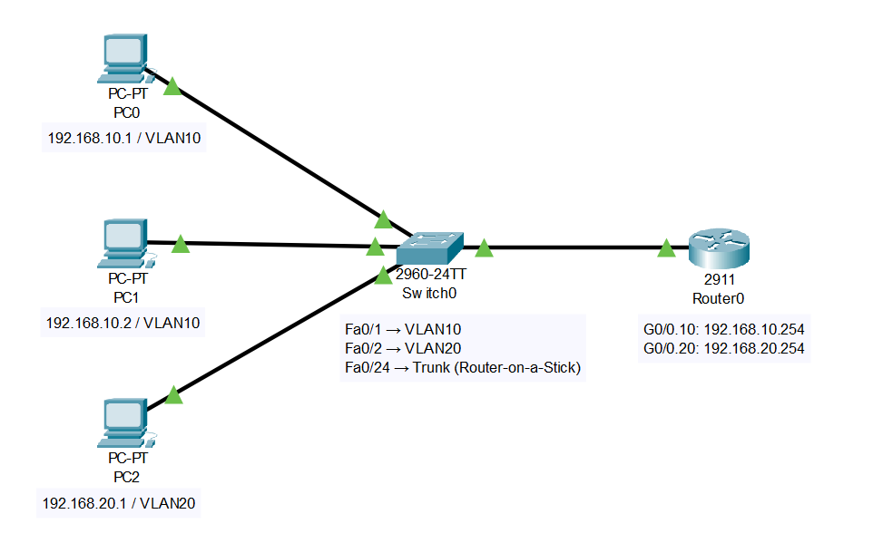

### トポロジの概要
- PC0 → VLAN10、PC1 → VLAN10、PC2 → VLAN20
- スイッチのポート接続
  - Fa0/1 → VLAN10
  - Fa0/2 → VLAN20
  - Fa0/24 → Trunk（Router-on-a-Stick 用）
- ルーターのサブインターフェース
  - G0/0.10: 192.168.10.254
  - G0/0.20: 192.168.20.254

## デバイス設定

### PC0での設定
- 「Desktop」タブの「IP Configuration」を選択して開く画面から、IPアドレス、サブネットマスク、デフォルトゲートウェイを設定する
- IPアドレスには自身のIPアドレス「192.168.100.10」、サブネットマスクには「/24」を表す「255.255.255.0」、デフォルトゲートウェイは「192.168.100.1」をいう線でつなぐ


### トポロジの概要
- PC0 → VLAN10、PC1 → VLAN10、PC2 → VLAN20
- スイッチのポート接続
  - Fa0/1 → VLAN10
  - Fa0/2 → VLAN20
  - Fa0/24 → Trunk（Router-on-a-Stick 用）
- ルーターのサブインターフェース
  - G0/0.10: 192.168.10.254
  - G0/0.20: 192.168.20.254

## デバイス設定

### PC0での設定
- 「Desktop」タブの「IP Configuration」を選択して開く画面から、IPアドレス、サブネットマスク、デフォルトゲートウェイを設定する
- IPアドレスには自身のIPアドレス「192.168.100.10」、サブネットマスクには「/24」を表す「255.255.255.0」、デフォルトゲートウェイは「192.168.100.1」を指定する
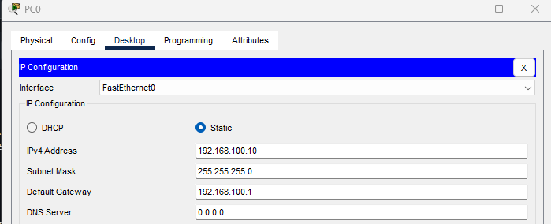

### PC1での設定
- IPアドレスには自身のIPアドレス「192.168.100.20」、サブネットマスクには「/24」を表す「255.255.255.0」、デフォルトゲートウェイは「192.168.100.1」を指定する
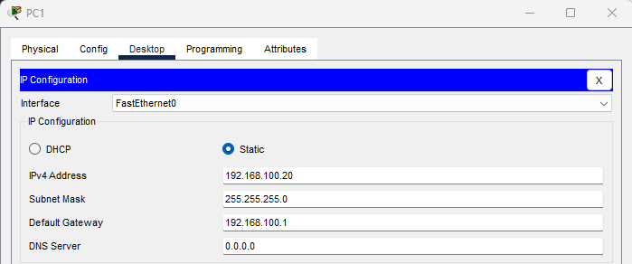

### PC2での設定
- IPアドレスには自身のIPアドレス「192.168.200.10」、サブネットマスクには「/24」を表す「255.255.255.0」、デフォルトゲートウェイは「192.168.200.1」を指定する
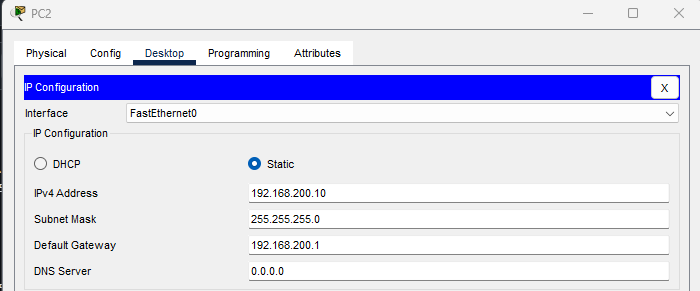

## スイッチ設定
- VLAN作成
  - VLAN10とVLAN20を作成する
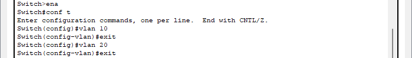

- 各インターフェース設定
  - Fa 0/1はVLAN10に所属するアクセスポートとして設定
  - Fa 0/2はVLAN10に所属するアクセスポートとして設定
  - Fa 0/3はVLAN20に所属するアクセスポートとして設定
  - Fa 0/24はトランクポートとして設定
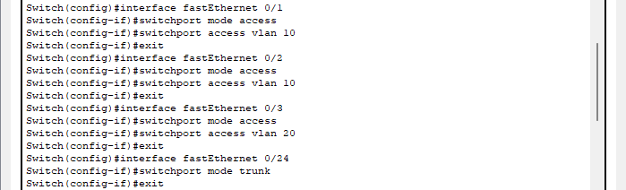
 
- VLAN設定内容確認
  - Fa 0/1とFa 0/2がVLAN10に、Fa 0/3がVLAN20にそれぞれ割り当てられているのがわかる
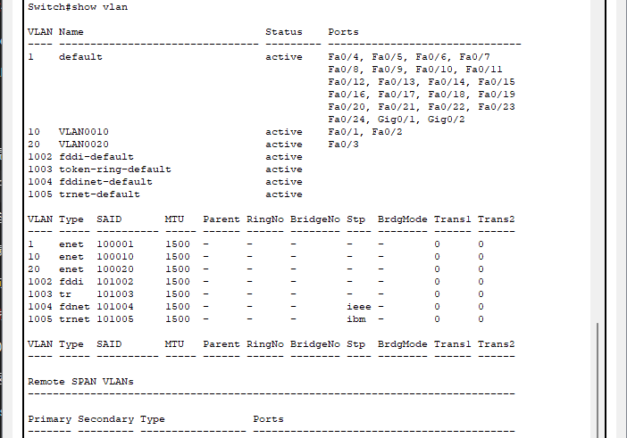

## ルーター設定
- サブインターフェースの作成
  - 1つの物理インターフェースを複数の異なるインターフェースとして扱うためにサブインターフェースを作成
  - G 0/0.1をVLAN10に所属するサブインターフェースとし、IPアドレスを「192.168.100.1」とする
  - G 0/0.2をVLAN20に所属するサブインターフェースとし、IPアドレスを「102.168.200.1」とする
  - 最後に物理インターフェースを起動
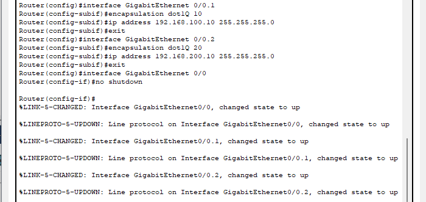

## Ping結果

- 同じVLAN間
  - PC0からPC1に繋がることを確認
  - ルーターを経由せず直接通信できるため当たり前に成功
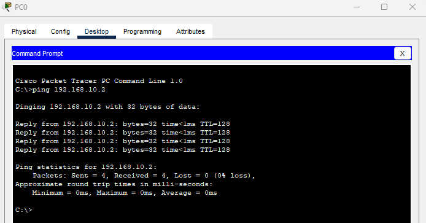

- 異なるVLAN間
  - PC0からPC2に繋がることを確認
  - 最初のPingがタイムアウト   
  - これはVLAN間ルーティングがまだARPテーブルに反映されていなかったためだと考えられる
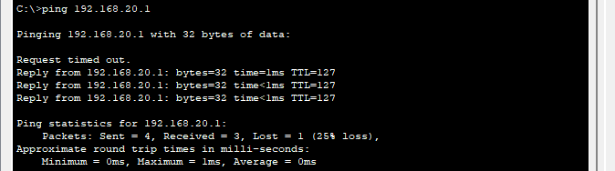

  - 2回目のPing以降はタイムアウトなく成功
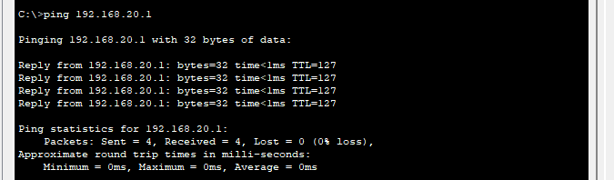

## 補足実験（Router-on-a-Stickなし）

あえてRouter-on-a-Stickを設定せずPingを試す。

### 実験手順

1. PC とスイッチは上の設定をそのまま使う    
2. ルーターはサブインターフェース（G0/0.10 や G0/0.20）を作らない  
   ルーター本体は電源を入れるだけ。

### Ping結果

- 同じVLAN間
  - PC0からPC1に繋がることを確認
  - ルーターを経由せず直接通信できるので成功  
  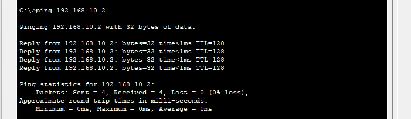

- 異なるVLAN間
  - PC0からPC2には繋がらない
  - Router-on-a-Stickがないと異なるVLAN間通信ができないことを確認した。
  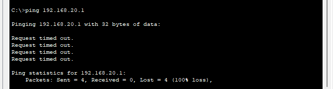


## 感想
以前、ネットで「外部ネットワークへのPingでは、1回目はARP情報がまだ取得されていないため失敗することがある」と読んだことがあり、
その状況を見るために家のPCからGoogle DNSへのPingで試したところ、異なるネットワークであるにも関わらず1回目から応答が返ってきた。 
Google以外の様々な外部のサーバーも試しましたが、失敗する例を見ることができなかった。

今回Router-on-a-Stickを使ったPingの実験で、異なるVLANに属するPC同士の最初のPingが失敗する様子を実際に観察でき、理論で読んだことと実験結果が結びついたのが面白く感じた。

今後は、より大規模なネットワークや複雑なルーティング構成にも応用できるように勉強していきたい。

2025/9/28


