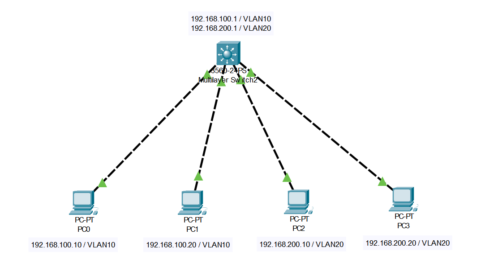

# L3スイッチによるVLAN間ルーティング
- 通常異なるVLANに属するPC同士は通信できない
- 異なるVLANに属するPC同士の通信を可能にする技術をVLAN間ルーティングという
- VLAN間ルーティングの実装には次の2通りがある
  - L2スイッチと外部ルーターを用いる方法
  - L3スイッチ単体を使う方法
- 今回は、L3スイッチを用いてVLAN間のルーティング設定を行う

## フォルダ構成
```
VLAN-L3/
├─ topology.png
├─ PC_IP/
│   ├─ PC0_ip.png
│   ├─ PC1_ip.png
│   ├─ PC2_ip.png
│   └─ PC3_ip.png
├─ Switch-command/
│   ├─ command1.png
│   ├─ command2.png
│   ├─ command3.png
│   └─ command4.png
├─ switch-config.txt
├─ vlan-lab.pkt
├─ ping-results/
│   ├─ PC0_to_PC1.png
│   ├─ PC0_to_PC2.png
│   ├─ PC0_to_PC3.png
│   └─ PC2_to_PC0.png
└─ README.md
```

## 内容
- L3スイッチの原理
- ネットワークトポロジ
- デバイス設定
- Ping応答結果
- 感想


### ファイル説明
- `topology.png` : ネットワークトポロジ図
- `PC_IP` : PCのIPアドレス設定
- `Switch-command` : L3スイッチの設定
- `switch-config.txt` : L3スイッチ設定抜粋テキストファイル
- `vlan-lab.pkt` : Packet Tracer 演習ファイル
- `ping-results/` : Ping結果画像

## L3スイッチのルーティングの原理
- L3スイッチはVLANごとに仮想インターフェース(SVI)を持ち、SVIごとにIPアドレスが割り当てられる
- PCは自分のデフォルトゲートウェイとして、所属するVLANのSVIのIPアドレスを設定する
- L3スイッチはそのSVIを使ってVLAN間のルーティングを行う

## ネットワークトポロジ
以下のような構成を作成する。
- PCは画面下部から「PC-PT」を選択してドラッグ&ドロップ
- スイッチは画面下部から「3560-24PS」を選択してドラッグ&ドロップ
- 各デバイス間を「Copper Cross-Over」という線でつなぐ



### PC0での設定
- 「Desktop」タグの「IP Configuration」を選択して開く画面から、IPアドレス、サブネットマスク、デフォルトゲートウェイを設定する
- IPアドレスには自身のIPアドレス「192.168.100.10」、サブネットマスクには「/24」を表す「255.255.255.0」，デフォルトゲートウェイは「192.168.100.1」を指定する


### PC1での設定
- IPアドレスには自身のIPアドレス「192.168.100.20」、サブネットマスクには「/24」を表す「255.255.255.0」，デフォルトゲートウェイは「192.168.100.1」を指定する


### PC2での設定
- IPアドレスには自身のIPアドレス「192.168.200.10」、サブネットマスクには「/24」を表す「255.255.255.0」，デフォルトゲートウェイは「192.168.200.1」を指定する


### PC3での設定
- IPアドレスには自身のIPアドレス「192.168.200.20」、サブネットマスクには「/24」を表す「255.255.255.0」，デフォルトゲートウェイは「192.168.200.1」を指定する


## VLAN 演習でのデバイス設定

- **スイッチ設定抜粋 (switch-config.txt)**
  - VLAN 10 と VLAN 20 を作成
  - 各ポートを VLAN に割り当て (Fa0/1 → VLAN10、Fa0/2 → VLAN20)
  - Trunk ポート設定 (Fa0/24) → ルーターとの Router-on-a-Stick 接続用

- **ルーター設定抜粋 (router-config.txt)**
  - サブインターフェース作成
    - G0/0.10: 192.168.10.254 / VLAN10
    - G0/0.20: 192.168.20.254 / VLAN20
  - Router-on-a-Stick 用に 802.1Q タグ付きインターフェース設定


## Ping結果

### PC0 → PC1
同じ VLAN 内の PC0 から PC1 への通信は問題なく成功しました。


### PC0 → PC2
異なる VLAN に属する PC0 から PC2 への通信は最初の Ping がタイムアウトしました。   
これは VLAN 間ルーティングがまだ ARP テーブルに反映されていなかったためだと考えられます。


2回目以降は成功し、VLAN 間通信が正しく機能していることが確認できました。


## 補足実験（Router-on-a-Stickなし）

今回の実験では、あえて Router-on-a-Stick を設定せずに Ping を試すとどうなるかを確認します。

### 実験手順

1. PC とスイッチは上の設定をそのまま使います。
   - PC0: 192.168.10.1 (VLAN10)
   - PC1: 192.168.10.2 (VLAN10)
   - PC2: 192.168.20.1 (VLAN20)
   - Fa0/1 → VLAN10 (PC0接続)
   - Fa0/2 → VLAN20 (PC2接続)
   - Fa0/24 → Trunk (スイッチ⇔ルーター接続)
     
2. ルーターはサブインターフェースを作らない  
   Router-on-a-Stick で作るサブインターフェース（例: G0/0.10 や G0/0.20）は作らずにおきます。  
   ルーター本体は電源を入れるだけ。

### 結果

- **同じ VLAN 間（PC0 → PC1）**  
  ルーターを経由せず直接通信できるので成功。  
  

- **異なる VLAN 間（PC0 → PC2）**  
  ルーターに VLAN ごとのゲートウェイが設定されていないため通信できず、Ping は失敗。  
  


## 感想
以前、ネットで「外部ネットワークへのPingでは、1回目はARP情報がまだ取得されていないため失敗することがある」と読んだことがあり、
その状況を見るために家のPCからGoogle DNSへのPingで試したところ、異なるネットワークであるにも関わらず1回目から応答が返ってきました。 
Google以外の様々な外部のサーバーも試しましたが、失敗する例を見ることができませんでした。

今回Router-on-a-Stickを使ったPingの実験で、異なるVLANに属するPC同士の最初のPingが失敗する様子を実際に観察でき、理論で読んだことと実験結果が結びついたのが面白く感じました。

今回の実験は、サブインターフェースやTrunkを用いたRouter-on-a-Stick構成の理解の第一歩となりました。  
今後は、より大規模なネットワークや複雑なルーティング構成にも応用できるように勉強していきたいです。

2025/9/28


