# L3スイッチによるVLAN間ルーティング
- 通常異なるVLANに属するPC同士は通信できない
- 異なるVLANに属するPC同士の通信を可能にする技術をVLAN間ルーティングという
- VLAN間ルーティングの実装には次の2通りがある
  - L2スイッチと外部ルーターを用いる方法
  - L3スイッチ単体を使う方法
- 今回は、L3スイッチを用いてVLAN間のルーティング設定を行う

## フォルダ構成
```
VLAN-L3/
├─ topology.png
├─ PC-IP/
│   ├─ PC0_ip.png
│   ├─ PC1_ip.png
│   ├─ PC2_ip.png
│   └─ PC3_ip.png
├─ Switch-command/
│   ├─ command1.png
│   ├─ command2.png
│   ├─ command3.png
│   └─ command4.png
├─ switch-config.txt
├─ vlan-lab.pkt
├─ ping-results/
│   ├─ PC0_to_PC1.png
│   ├─ PC0_to_PC2.png
│   ├─ PC0_to_PC3.png
│   └─ PC2_to_PC0.png
└─ README.md
```
### ファイル説明
- `topology.png` : ネットワークトポロジ図
- `PC-IP` : PCのIPアドレス設定
- `Switch-command` : L3スイッチの設定
- `switch-config.txt` : L3スイッチ設定抜粋テキストファイル
- `vlan-lab.pkt` : Packet Tracer 演習ファイル
- `ping-results/` : Ping結果画像
  
## 内容
- L3スイッチの原理
- ネットワークトポロジ
- デバイス設定
- Ping結果
- 感想


## L3スイッチのルーティングの原理
- L3スイッチはVLANごとに仮想インターフェース(SVI)を持ち、SVIごとにIPアドレスが割り当てられる
- PCは自分のデフォルトゲートウェイとして、所属するVLANのSVIのIPアドレスを設定する
- L3スイッチはそのSVIを使ってVLAN間のルーティングを行う

## ネットワークトポロジ
以下のような構成を作成する。
- PCは画面下部から「PC-PT」を選択してドラッグ&ドロップ
- スイッチは画面下部から「3560-24PS」を選択してドラッグ&ドロップ
- 各デバイス間を「Copper Cross-Over」という線でつなぐ


## デバイス設定

### PC0での設定
- 「Desktop」タグの「IP Configuration」を選択して開く画面から、IPアドレス、サブネットマスク、デフォルトゲートウェイを設定する
- IPアドレスには自身のIPアドレス「192.168.100.10」、サブネットマスクには「/24」を表す「255.255.255.0」，デフォルトゲートウェイは「192.168.100.1」を指定する
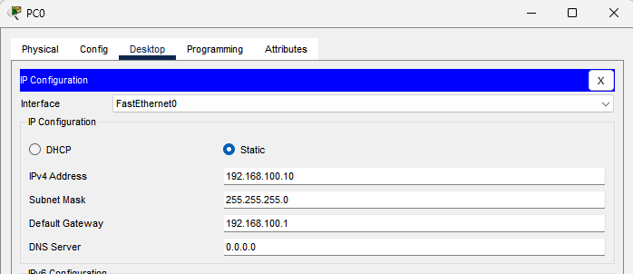

### PC1での設定
- IPアドレスには自身のIPアドレス「192.168.100.20」、サブネットマスクには「/24」を表す「255.255.255.0」，デフォルトゲートウェイは「192.168.100.1」を指定する
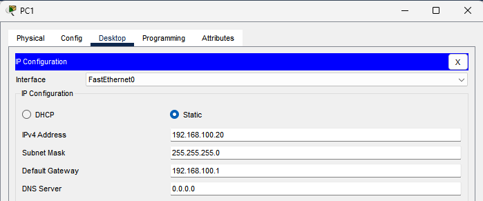

### PC2での設定
- IPアドレスには自身のIPアドレス「192.168.200.10」、サブネットマスクには「/24」を表す「255.255.255.0」，デフォルトゲートウェイは「192.168.200.1」を指定する
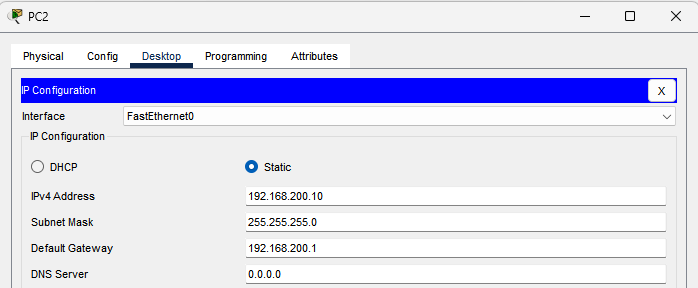

### PC3での設定
- IPアドレスには自身のIPアドレス「192.168.200.20」、サブネットマスクには「/24」を表す「255.255.255.0」，デフォルトゲートウェイは「192.168.200.1」を指定する
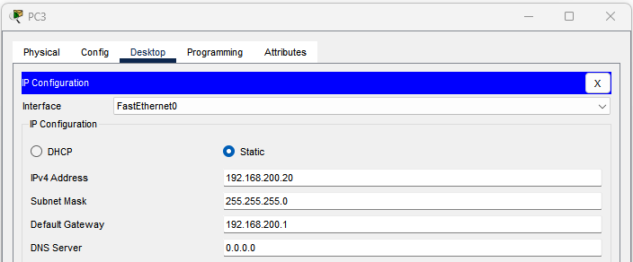

## スイッチ設定
- ルーティングがデフォルトで無効になっているため有効化する
 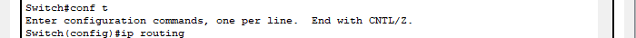

- VLAN作成
  - VLAN10とVLAN20を作成
  - それぞれのSVIとして192.168.100.1、192.168.200.1を設定
 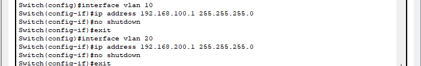

- 各インターフェース設定
  - Fa 0/1はVLAN10に所属するアクセスポートとして設定
  - Fa 0/2はVLAN10に所属するアクセスポートとして設定
  - Fa 0/3はVLAN20に所属するアクセスポートとして設定
  - Fa 0/4はVLAN20に所属するアクセスポートとして設定
 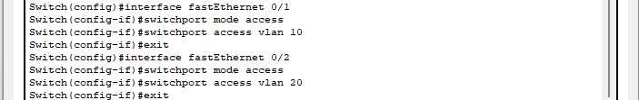

- VLAN設定内容確認
  - Fa 0/1とFa 0/2がVLAN10に、Fa 0/3とFa 0/4がVLAN20にそれぞれ割り当てられているのがわかる
 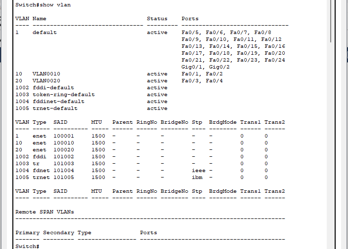

### Ping結果

- 同じVLAN間
  - PC0からPC1に繋がることを確認
  - ルーターを経由せず直接通信できるため当たり前に成功
  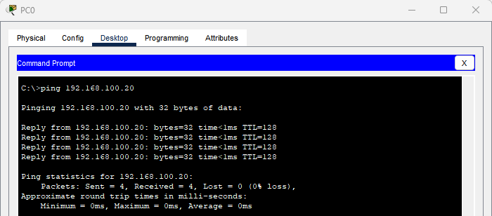

- 異なるVLAN間
  - PC0からPC2に繋がることを確認
  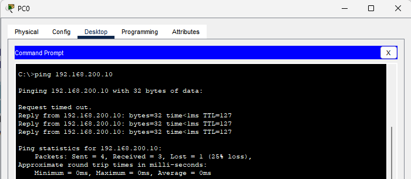
  - PC0からPC3に繋がることを確認
  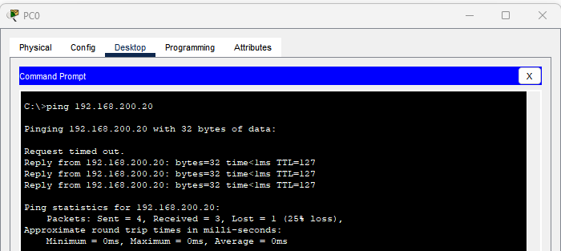
  - PC2からPC0に繋がることを確認
  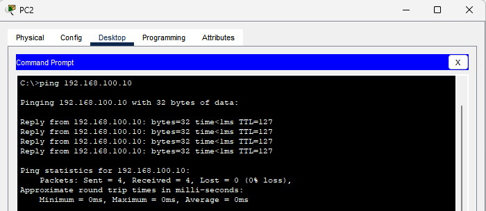

### まとめ
L3スイッチを用いることで、異なるVLANに属するPC同士のPing応答が返ってくることを確認できた。

## 感想
実はこの実験に成功するのに5時間かかった。
L3スイッチの設定コマンドを打つ時に間違えていることに気づかずに間違いを探していて、結局単なる入力ミスであることがわかった。
間違いに気づいてからはすぐに作り直すことができた。
仮想環境だから気軽に試せるものの、もし実環境で誤った設定のまま動作させてしまったらと思うと怖くなった。
はやく結果が気になるあまり急いでコマンドを打つのではなく慎重に作業したいと思う。

2025/9/29


