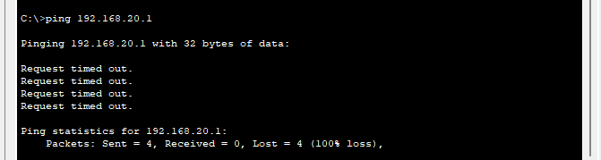

# VLAN編ネットワーク演習
VLANはネットワークを分ける技術です。  
異なるVLANに属するPC同士は、普通に接続しても直接通信できません。  
そこで「Router-on-a-stick」というルーターを使った設定をすると、異なるVLAN間の通信が可能になります。


## 内容
- 複数VLANの設定
- Router-on-a-Stick構成でVLAN間ルーティング
- PC間通信の確認（Ping結果観察）

## フォルダ構成
```
VLAN/
├─ topology.png
├─ switch-config.txt
├─ router-config.txt
├─ vlan-lab.pkt
├─ ping-results/
│   ├─ pc0_to_pc1.png
│   ├─ pc0_to_pc2_first_fail.png
│   └─ pc0_to_pc2_success.png
└─ README.md
```

### ファイル説明
- `topology.png` : ネットワークトポロジ図
- `switch-config.txt` : スイッチ設定抜粋
- `router-config.txt` : ルーター設定抜粋
- `vlan-lab.pkt` : Packet Tracer 演習ファイル
- `ping-results/` : Ping結果画像

## ネットワークトポロジ

今回の VLAN 演習で構築したネットワークは以下の通りです。


### トポロジの概要
- PC0 → VLAN10、PC1 → VLAN10、PC2 → VLAN20
- スイッチのポート接続
  - Fa0/1 → VLAN10
  - Fa0/2 → VLAN20
  - Fa0/24 → Trunk（Router-on-a-Stick 用）
- ルーターのサブインターフェース
  - G0/0.10: 192.168.10.254
  - G0/0.20: 192.168.20.254

## VLAN 演習でのデバイス設定

- **スイッチ設定抜粋 (switch-config.txt)**
  - VLAN 10 と VLAN 20 を作成
  - 各ポートを VLAN に割り当て (Fa0/1 → VLAN10、Fa0/2 → VLAN20)
  - Trunk ポート設定 (Fa0/24) → ルーターとの Router-on-a-Stick 接続用

- **ルーター設定抜粋 (router-config.txt)**
  - サブインターフェース作成
    - G0/0.10: 192.168.10.254 / VLAN10
    - G0/0.20: 192.168.20.254 / VLAN20
  - Router-on-a-Stick 用に 802.1Q タグ付きインターフェース設定


## Ping結果

### PC0 → PC1
同じ VLAN 内の PC0 から PC1 への通信は問題なく成功しました。


### PC0 → PC2
異なる VLAN に属する PC0 から PC2 への通信は最初の Ping がタイムアウトしました。   
これは VLAN 間ルーティングがまだ ARP テーブルに反映されていなかったためだと考えられます。


2回目以降は成功し、VLAN 間通信が正しく機能していることが確認できました。


## 補足実験（Router-on-a-Stickなし）

今回の実験では、あえて Router-on-a-Stick を設定せずに Ping を試すとどうなるかを確認します。

### 実験手順

1. PC とスイッチは上の設定をそのまま使います。
   - PC0: 192.168.10.1 (VLAN10)
   - PC1: 192.168.10.2 (VLAN10)
   - PC2: 192.168.20.1 (VLAN20)
   - Fa0/1 → VLAN10 (PC0接続)
   - Fa0/2 → VLAN20 (PC2接続)
   - Fa0/24 → Trunk (スイッチ⇔ルーター接続)
     
2. ルーターはサブインターフェースを作らない  
   Router-on-a-Stick で作るサブインターフェース（例: G0/0.10 や G0/0.20）は作らずにおきます。  
   ルーター本体は電源を入れるだけ。

### 結果

- **同じ VLAN 間（PC0 → PC1）**  
  ルーターを経由せず直接通信できるので成功。  
  

- **異なる VLAN 間（PC0 → PC2）**  
  ルーターに VLAN ごとのゲートウェイが設定されていないため通信できず、Ping は失敗。  
  


## 感想
以前、ネットで「外部ネットワークへのPingでは、1回目はARP情報がまだ取得されていないため失敗することがある」と読んだことがあり、
その状況を見るために家のPCからGoogle DNSへのPingで試したところ、異なるネットワークであるにも関わらず1回目から応答が返ってきました。 
Google以外の様々な外部のサーバーも試しましたが、失敗する例を見ることができませんでした。

今回、異なるVLANに属するPC同士のPingの実験で最初のPingが失敗する様子を実際に観察でき、理論で読んだことと実験結果が結びついたのが面白く感じました。


